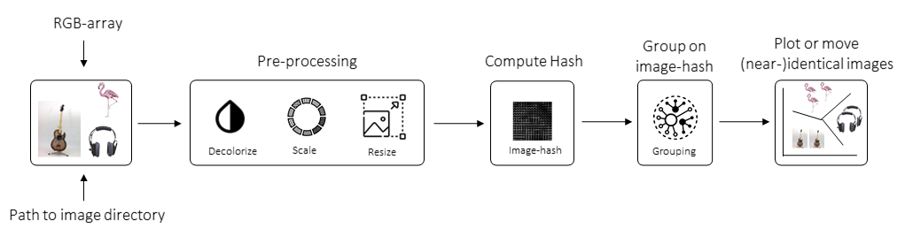

.. _code_directive:

-------------------------------------

Abstract
''''''''

Background
    Searching for (near-)identical photos at your system can be a tedious effort because you need to click across your entire system,
    containing likely thousands of photos, and then decide for each photo whether it is a "similar" one.
    The most straightforward approach to detect identical photos would be on file size or filename.
    However, photos are usually derived from different sources such as mobile devices, social media apps, which leads to
    differences in file size, name, but also in resolution, scaling, compression, and brightness.
    
Aim
    Hash functions are ideal to detect  photos because of the robustness against minor changes.
    The aim of ``undouble`` is to detect (near-)identical images. It works using a multi-step proces of carefully pre-processing the images,
    computing the image-hash, evaluating the hash-differences across all images, and group images with similar/identical image-hash. 

Results
    ``undouble`` is Python package for to detect images with similar/identical image-hash.
    There are many applications, such as in digital forensics, copyright enforcement, and more generically for disk space reduction and thus undoubling.

    
Schematic overview
'''''''''''''''''''

The schematic overview of our approach is as following:

.. _schematic_overview:

.. include:: add_bottom.add