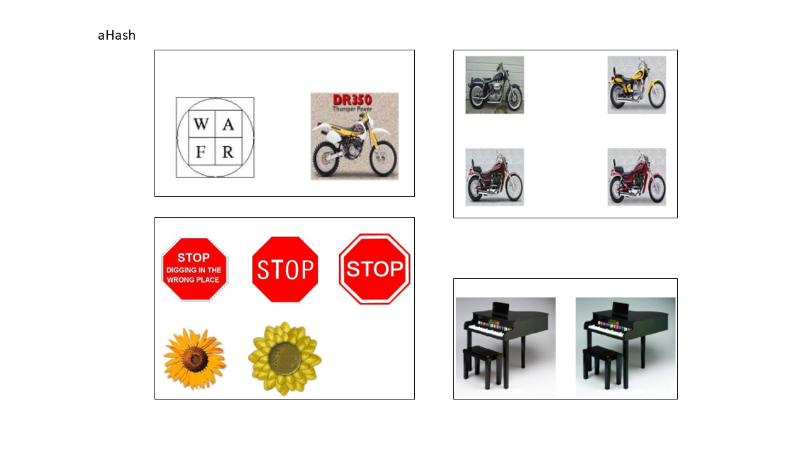
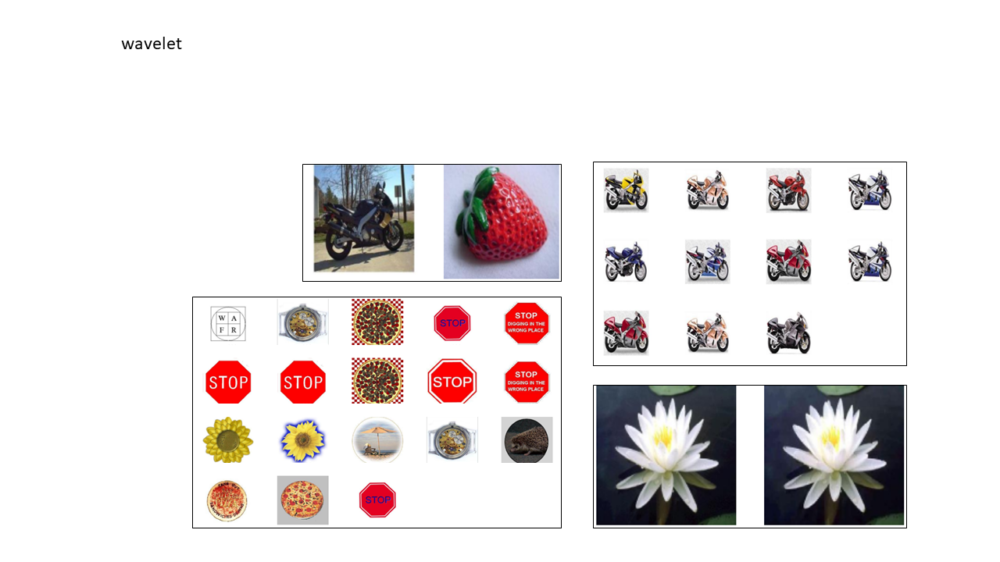
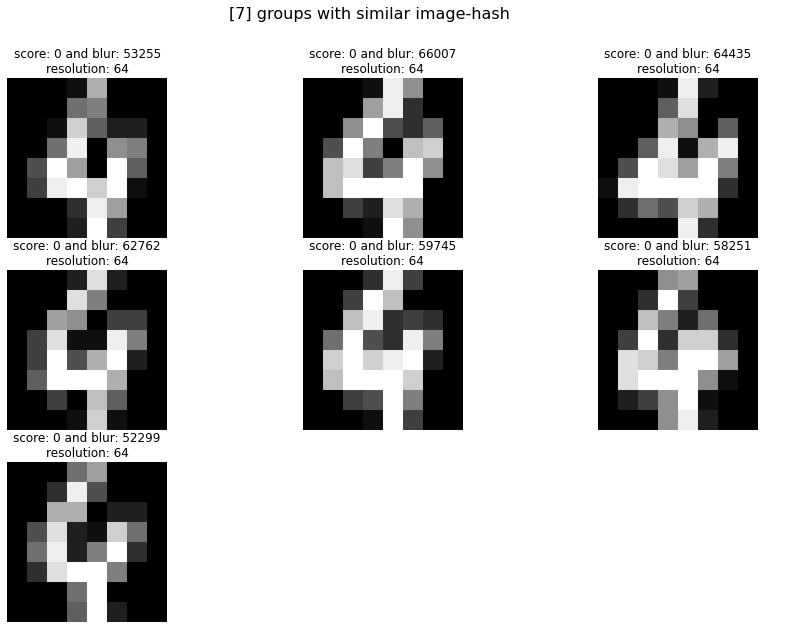

Flowers dataset
##################

Analyze for similar flowers in the example dataset. Load the data and initialize a model with **phash**.

.. code:: python

    # Import library
    from undouble import Undouble
    
    # Init with default settings
    model = Undouble(method='phash', hash_size=8)
    
    # Import example data
    targetdir = model.import_example(data='flowers')
    
    # Importing the files files from disk, cleaning and pre-processing
    model.import_data(targetdir)
    
    # Compute image-hash
    model.compute_hash()

    # [undouble] >INFO> Store examples at [./undouble/data]..
    # [undouble] >INFO> Downloading [flowers] dataset from github source..
    # [undouble] >INFO> Extracting files..
    # [undouble] >INFO> [214] files are collected recursively from path: [./undouble/data/flower_images]
    # [undouble] >INFO> Reading and checking images.
    # [undouble] >INFO> Reading and checking images.
    # 100%|---------| 214/214 [00:02<00:00, 96.56it/s]
    # [undouble] >INFO> Extracting features using method: [phash]
    # 100%|---------| 214/214 [00:00<00:00, 3579.14it/s]
    # [undouble] >INFO> Build adjacency matrix with phash differences.
    # [undouble] >INFO> Extracted features using [phash]: (214, 214)
    # 100%|---------| 214/214 [00:00<00:00, 129241.33it/s]

    
Group and plot
************************

All hashes are computed but images with similar hash are not grouped yet.
The following few lines will group the images and make the plots.

.. code:: python

    # Group images with image-hash <= threshold
    model.group(threshold=0)

    # Plot the images
    model.plot()

.. |flower_group1| image:: ../figs/flowers1.png
.. |flower_group2| image:: ../figs/flowers2.png
.. |flower_group3| image:: ../figs/flowers3.png
.. table:: Groupings
   :align: center

   +------------------+
   | |flower_group1|  |
   +------------------+
   | |flower_group2|  |
   +------------------+
   | |flower_group3|  |
   +------------------+

Get identical images
***********************

.. code:: python

    # Import library
    for i, group in enumerate(model.results['select_pathnames']):
        print('----------------------------GROUP %s----------------------------' %i)
        print(group)

Move files
***********************

The move function :func:`undouble.undouble.Undouble.move_to_dir` will systematically move the images.
A threshold of 0 will group images with an identical image hash. However, the threshold of 10 showed the best results when undoubling my personal photo deck because photos, such as from bursts, were also grouped.
Before moving any of the images, the resolution and blurness of all images that are part of a group are checked.
The image in the group with the highest resolution will be copied, and all other images are moved to the **undouble** subdirectory.

.. code:: python

    model.move_to_dir()
    
    # >Wait! Before you continue, you are at the point of physically moving files!
    # >[7] similar images are detected over [3] groups.
    # >[4] images will be moved to the [undouble] directory.
    # >[3] images will be copied to the [undouble] directory.
    # >Type <ok> to proceed.

Plot image hash
***********************

To plot the image hashes of the flowers we need to return the dict (see parameter). I will plot the hash of 1 flower image but the hashes can be plotted for all images.

.. code:: python

	# plot the image-hash for some specified indexes:
	# The index is based on the ordering in the results:
	print(model.results.keys())
	# Make the plot for the first index
	model.plot_hash(idx=[0])
    
	# Make the plot for a specific filenames
    filenames = model.results['filenames'][0:2]
	model.plot_hash(filenames=filenames)

# Doing the same only manually:

.. code:: python

	# Compute image-hash
	results = model.compute_hash(return_dict=True)

	fig, ax=plt.subplots(1,2)
	ax[0].imshow(results['img'][0])
	ax[1].imshow(results['img_hash_bin'][0].reshape(hash_size, hash_size), cmap='gray')
	plt.title('image hash hex: %s' %(results['img_hash_hex'][0]))

.. |flower_group4| image:: ../figs/imghash_example.png
.. table:: Plot image hash
   :align: center

   +------------------+
   | |flower_group4|  |
   +------------------+

101 objects dataset
#####################

I utilized the Caltech 101 [1] dataset and saved it to my local disk. I will analyze the results with aHash, pHash, dHash, and Wavelet hash.
The Caltech dataset contains 9144 real-world images belonging to 101 categories. About 40 to 800 images per category.
The size of each image is roughly 300 x 200 pixels. For the input to undouble, we can simply provide the path location
where all images are stored, and all subdirectories will be recursively analyzed too.
Note that this dataset does not contain ground truth labels with identical images labels.

.. code:: python

    # Import library
    from undouble import Undouble
    # Initialize model
    model = Undouble(method='phash', hash_size=8)
    # Import example data
    targetdir = './101_ObjectCategories'
    # Importing the files files from disk, cleaning and pre-processing
    model.import_data(targetdir)
    # Compute image-hash
    model.compute_hash()
    
    # [undouble] >INFO> Extracting images from: [D://magweg/101_ObjectCategories]
    # [undouble] >INFO> [9144] files are collected recursively from path: [D://magweg/101_ObjectCategories]
    # [undouble] >INFO> [9144] images are extracted.
    # [undouble] >INFO> Reading and checking images.
    # [undouble] >INFO> Reading and checking images.
    # 100%|---------| 9144/9144 [00:29<00:00, 305.49it/s]
    # [undouble] >INFO> Extracting features using method: [ahash]
    # 100%|---------| 9144/9144 [00:01<00:00, 5826.17it/s]
    # [undouble] >INFO> Build adjacency matrix with ahash differences.
    
    # Group images that are identical in image-hash, i.e. those with a hash difference of 0.
    model.group(threshold=0)
    
    # print([*model.results.keys()])
    #   * img: Preprocessed images
    #   * pathnames: Absolute path location to image file
    #   * filenames: Filename
    #   * select_pathnames: Selected path locations that have image-hash score <= threshold
    #   * select_scores: Image-hash scores of the selected images
    
    # Plot the marked images
    model.plot()
    
    # Move the files
    model.move_to_dir()
    

Average hash results
**************************

The average hash function detected 135 groups that could be linked to 335 images with an identical hash (threshold=0) based on the input hash size of 8 (64-bit). Despite identical images being detected, most of the groups showed collisions such as the top and bottom left, and/or near-identical images, such as the motorbikes.
By increasing the hash size to 16 (256-bit), 28 groups for 64 images were detected. No collisions were present but only some near-identical images, such as the motorbikes.

.. table:: Average hash
   :align: center

   +---------------------+
   | |ahash_101objects|  |
   +---------------------+

Differential hash results
**************************

The differential hash function detected 28 images that could be linked to 31 images with an identical hash (threshold=0).
A visual inspection showed no collisions but near-identical images (two motorbikes) were detected.
By increasing the hash size to 16 (256-bit), 8 groups for 16 images were detected. No collisions were present but only some near-identical images, such as the motorbikes. By increasing the hash size to 16 (256-bit), 8 groups for 16 images were detected.
No collisions and no near-identical images were present only images that are visually similar.

.. |dhash_101objects| image:: ../figs/dhash_101objects.png

.. table:: Differential hash
   :align: center

   +---------------------+
   | |dhash_101objects|  |
   +---------------------+

Perceptual hash results
**************************

The perceptual hash function detected 38 groups that could be linked to 41 images with an identical hash (threshold=0).
A visual inspection showed no collisions but near-identical images were detected, such as the motorbikes, as illustrated in the figure below.
By increasing the hash size to 16 (256-bit), 10 groups for 20 images were detected. No collisions and no near-identical images were present only images that are visually similar.

.. |phash_101objects| image:: ../figs/phash_101objects.png

.. table:: Perceptual hash
   :align: center

   +---------------------+
   | |phash_101objects|  |
   +---------------------+

Haar wavelet hash results
**************************

The wavelet hash function detected 141 groups that could be linked to 513 images with an identical hash (threshold=0) based on the input hash size of 8 (64-bit).
A visual inspection showed that almost all groups contained either collisions or near-identical images.
Who had known that a strawberry could have a similar image-hash as the motorbike? By increasing the hash size to 16 (256-bit), 25 groups for 51 images were detected.
No collisions were present but only some near-identical images, such as the motorbikes.

.. table:: Haar wavelet hash
   :align: center

   +---------------------+
   | |wave_101objects|   |
   +---------------------+

mnist dataset
##################

Finding identical images for the mnist digits can be done as following:

.. code:: python

	# Import library
	from undouble import Undouble

	# Init with default settings
	model = Undouble()

	# Import example data
	X, y = model.import_example(data='mnist')

	# Importing the files files from disk, cleaning and pre-processing
	model.import_data(X)

	# Compute image-hash
	model.compute_hash(method='phash', hash_size=16)

	# Group images with image-hash <= threshold
	model.group(threshold=0)

	# Plot the images
	model.plot()

.. table:: Example of images with similar hash
   :align: center

   +------------------+
   | |mnist_group5|   |
   +------------------+

Import images from url location
##################################

Images can also be imported from url locations.
Each image is first downloaded and stored on a (specified) temp directory.
In this example we will download 5 images from url locations. Note that url images and path locations can be combined.

.. code:: python

	from undouble import Undouble

	# Init with default settings
	model = Undouble()

	# Importing the files files from disk, cleaning and pre-processing
	url_to_images = ['https://erdogant.github.io/datasets/images/flower_images/flower_orange.png',
			 'https://erdogant.github.io/datasets/images/flower_images/flower_white_1.png',
			 'https://erdogant.github.io/datasets/images/flower_images/flower_white_2.png',
			 'https://erdogant.github.io/datasets/images/flower_images/flower_yellow_1.png',
			 'https://erdogant.github.io/datasets/images/flower_images/flower_yellow_2.png']

	# Import into model
	model.import_data(url_to_images)

	# Compute image-hash
	model.compute_hash(method='phash', hash_size=16)

	# Find images with image-hash <= threshold
	model.group(threshold=0)

	# Plot the images
	model.plot()

*References*

    * [1] L. Fei-Fei, R. Fergus, and P. Perona. Learning generative visual models from few training examples: an incremental Bayesian approach tested on 101 object categories. IEEE. CVPR 2004, Workshop on Generative-Model Based Vision. 2004

.. include:: add_bottom.add