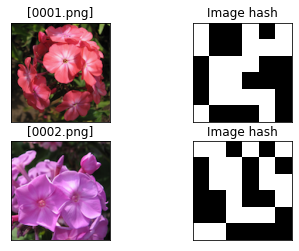

Core functionalities
************************

The following core functionalities allows to group images on image-hash, and systematically move the images.

.. code:: python

    .import_data()
    .compute_hash()
    .group()
    .plot()
    .plot_hash()
    .move()

Moving Images
***********************

Processing the images is performed with the same function, independent of the input-type.

.. code:: python

    # Importing the files files from disk, cleaning and pre-processing
    model.import_data(input_list_of_files)
    model.import_data(input_directory)
    model.import_data(input_img_array)
    
    # Compute image-hash
    model.compute_hash()
    
    # Find images with image-hash <= threshold
    model.group(threshold=0)
    
    # Plot the images
    model.plot()
    
    # Move the images
    # model.move()

Import with restriction
***********************

In the following example we will read only images with the extension png, tiff, jpg and jfif. Images are not transformed into grayscale, and are reduced in dimension to 128x128.

.. code:: python

	from undouble import Undouble
	# Initialize
	model = Undouble(ext=['png', 'tiff', 'jpg', 'jfif'], grayscale=False, dim=(128, 128))
	# Import data
	filenames = model.import_example(data='flowers')
	# Check whether in is dir, list of files or array-like
	model.import_data(filenames)
	print(model.results.keys())
	# dict_keys(['img', 'feat', 'pathnames', 'filenames'])
	# Note that feat is still empty and will be filled after computing the image-hashes.

Compute_hash
******************

The *compute_hash* function, :func:`undouble.undouble.Undouble.compute_hash`, computes the hash for each image, and returns the adjacency matrix containing image-hash distances between the images.
The image-hash is computed using one of the following functions:

.. code:: bash

    * 'ahash'		Average hash
    * 'phash'		Perceptual hash
    * 'dhash'		Difference hash
    * 'whash-haar'	Haar wavelet hash
    * 'whash-db4'	Daubechies wavelet hash
    * 'colorhash'	HSV color hash
    * 'crop-resistant'	Crop-resistant hash

.. code:: python

    # Initialize
    model = Undouble(method='phash', hash_size=8)
    # Import data
    filenames = model.import_example(data='flowers')
    # Check whether in is dir, list of files or array-like
    model.import_data(filenames)
    # Compute image-hash
    model.compute_hash()

    # Note feat now contains image-hash comparison across all images.
    # Each row and column represents the input files model.results['pathnames'] and model.results['filenames']
    # The diagonal depicts the image-hash distance to itself (=0)
    print(model.results['feat'])
    # [[ 0. 26. 24. ... 32. 28. 24.]
    #  [26.  0. 26. ... 30. 20. 32.]
    #  [24. 26.  0. ... 28. 26. 24.]
    #  ...
    #  [32. 30. 28. ...  0. 26. 32.]
    #  [28. 20. 26. ... 26.  0. 32.]
    #  [24. 32. 24. ... 32. 32.  0.]]

    # Make pandas dataframe:
    # import pandas as pd
    # df = pd.DataFrame(data=model.results['feat'], index=model.results['filenames'], columns=model.results['filenames'])

Grouping images
************************

At this point image-hashes are computed and we can start grouping images with function :func:`undouble.undouble.Undouble.group`.
The threshold can now be used to either group images with identical hash or images with near-identical hash.

.. code:: python

    # Group images with image-hash <= threshold
    model.group(threshold=0)
    # 100%|██████████| 214/214 [00:00<00:00, 105312.81it/s]
    # [undouble] >INFO> Number of groups with similar images detected: 3
    # [undouble] >INFO> [3] groups are detected for [7] images.

    print(model.results.keys())
    # dict_keys(['img', 'feat', 'pathnames', 'filenames', 'select_pathnames', 'select_scores', 'stats'])
    # The keys: 'select_pathnames' and 'select_scores' are the grouped images.
    # Number of groups    
    print(len(model.results['select_pathnames']))
    for i, group in enumerate(model.results['select_pathnames']):
        print('----------------------------GROUP %s----------------------------' %i)
        print(group)
    

Moving images
************************

The move function :func:`undouble.undouble.Undouble.move` is created to systematically move the images that are grouped.
A threshold of 0 will group images with an identical image hash. However, the threshold of 10 showed the best results when undoubling my personal photo deck because photos, such as from bursts, were also grouped.
Before moving any of the images, the resolution and blurness of all images that are part of a group are checked.
The image in the group with the highest resolution will be copied, and all other images are moved to the **undouble** subdirectory.

Plot
************

Plot all images that could be combined into a group with identical image-hash or <= threshold. 
The function can be found here: :func:`undouble.undouble.Undouble.plot`

Plot hash
************

This functionality is practical if you need to investigate the grouping of images based on the hashes that are generated: :func:`undouble.undouble.Undouble.plot_hash`

.. code:: python

    # Import library
    from undouble import Undouble

    # Init with default settings
    model = Undouble()

    # Import example data
    # targetdir = model.import_example(data='flowers')

    # Importing the files files from disk, cleaning and pre-processing
    model.import_data(r'./undouble/data/flower_images/')

    # Compute image-hash
    model.compute_hash(method='phash', hash_size=6)

    # Plot the image-hash for a set of indexes
    model.plot_hash(idx=[0, 1])

    # Plot the image-hash for a set of filenames
    filenames = model.results['filenames'][0:2]
    filenames = ['0001.png', '0002.png']
    model.plot_hash(filenames=filenames)

.. table:: Plot image hash
   :align: center

   +------------------+
   | |imghash01|      |
   +------------------+

Preprocessing
###############

Before we can determine the image-hash from an image, we need to decolorize the image, normalize the pixel values, and scale the image.
The reasoning for decolorizing is that most information we need to "recognize" an image is readily present in the grayscale channel.
In addition, the reduction from 24 bits per pixel for RGB to 8 bits per pixel is computationally more attractive; time-wise and memory-wise.
The next step is to downsample/scale the image to a smaller size. Most often, a 64-bit hash is chosen,
which simply means that the image is downsampled to 8 x 8 pixels. If ``grayscale`` is set to *True*, the ``cv2.COLOR_GRAY2RGB`` is derived ``python-opencv``.

The pre-processing has 4 steps and are exectued in this order.
    * 1. Reading image
    * 2. Conversion to gray-scale (user defined)
    * 3. Scaling color pixels between [0-255]
    * 4. Resizing

scaling
************

Scaling of images is only applicable for 2D-arrays (images).
Scaling data is an import pre-processing step to make sure all data is ranged between the minimum and maximum range.

The images are scaled between [0-255] by the following equation:

    Ximg * (255 / max(Ximg) )

Resizing
************

Images can be resized, for which 128x128 pixels is the default.
The function depends on the functionality of ``python-opencv`` with the interpolation: ``interpolation=cv2.INTER_AREA``.

Generic functionalities
###########################

``undouble`` contains various generic functionalities that are internally used but may be usefull too in other applications.

compute_blur
***************
load the image, convert it to grayscale, and compute the focus measure of the image using the Variance of Laplacian method.\
The returned scores <100 are generally more blurry.
Examples can be found here: :func:`undouble.undouble.compute_blur`

.. code:: python

    # Import library
    import undouble as ud
    # Download
    score = ud.compute_blur('absolute_path_to_image.png')

wget
***************
Download files from the internet and store on disk.
Examples can be found here: :func:`undouble.undouble.wget`

.. code:: python

    # Import library
    import undouble as ud
    # Download
    images = ud.wget('https://erdogant.github.io/datasets/flower_images.zip', 'c://temp//flower_images.zip')

unzip
***************
Unzip files into a destination directory.
Examples can be found here: :func:`undouble.undouble.unzip`

.. code:: python

    # Import library
    import undouble as ud
    # Unzip to path
    dirpath = ud.unzip('c://temp//flower_images.zip')

set_logger
***************
Change status of the logger.
Examples can be found here: :func:`undouble.undouble.set_logger`

.. code:: python

    # Change to verbosity message of warnings and higher
    set_logger(verbose=30)

.. include:: add_bottom.add